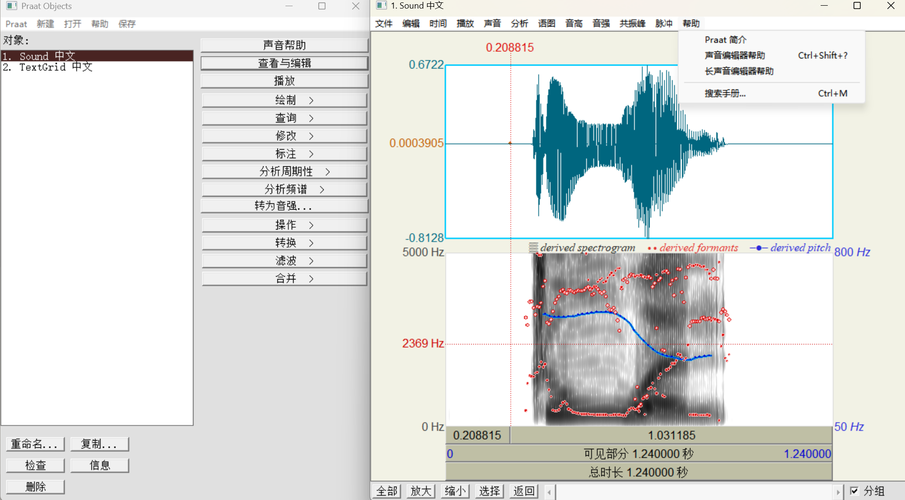
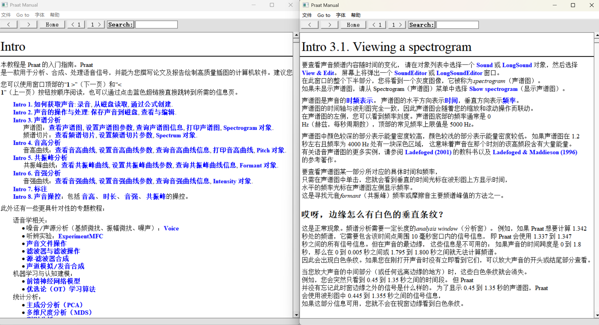

> [!NOTE]
> **Praat 汉化/中文版说明**
> 
> 本仓库是语音学分析软件 **Praat** 的中文汉化/本地化版本。
> - **项目主页 / 源码仓库**：[KasumiKitsune/praat.github.io](https://github.com/KasumiKitsune/praat.github.io)
> - **官方英文主页**：[praat.org](https://praat.org) / [GitHub 官方仓库](https://github.com/praat/praat)
> 
> 本文档是 Praat 英文 `README.md` 的中文翻译版本，旨在为中文用户提供更好的阅读和开发参考。

  
  

> [!TIP]
> **本地化专属新增特性 (Unique Features)**
> 
> 为了提供更好的使用体验，本中文本地化版本在官方 Praat 的基础上，额外开发或移植了以下专属特性：
> * **Windows 平台支持原生文件拖入打开 (Drag-and-Drop for Windows)**
>   * **特性描述**：官方 Windows 版 Praat 长期不支持拖拽文件打开。我们移植并适配了 macOS 平台的文档打开回调机制，在 Windows 版本的底层 Motif 模拟器中实现了 native 拖拽响应接口。
>   * **使用方法**：可直接将支持的语音、标注或脚本文件（如 `.wav`、`.TextGrid`、`.praat` 等）拖拽进 Praat 的任意窗口，即可自动加载至对象列表（Objects）中。支持一次性拖入并同时加载多个文件。
> * **启动时默认隐藏图像窗口 (Praat Picture Window Auto-Hide on Startup)**
>   * **特性描述**：官方原版 Praat 在启动时会强制打开“对象窗口”（Objects）与“图像窗口”（Praat Picture），这在许多不经常绘图的使用场景下会额外占用屏幕空间。本版本优化为启动时**默认隐藏/不主动打开**图像窗口，为您提供更加清爽的工作区。
>   * **打开入口**：如果您需要使用图像窗口，只需在对象窗口（Objects）的左上角菜单点击 **`Praat`** -> 选择 **`打开图像窗口 (Praat Picture)`**，即可立即打开并使用。

# Praat：用计算机做语音学分析

欢迎使用 Praat！Praat 是一款用于在计算机上进行语音学研究的语音分析工具。
Praat 能够分析、合成以及处理（操纵）语音，并为您的论文或出版物创建高质量的图像。
Praat 由阿姆斯特丹大学语音科学研究所的 Paul Boersma 和 David Weenink 开发。

一些最显著的特性包括：

#### 语音分析 (Speech analysis)

Praat 允许您分析语音的各个方面，包括基频（pitch）、共振峰（formant）、强度（intensity）和音质（voice quality）。
您可以使用声谱图（spectrograms，声音随时间变化的视觉表示）和耳蜗谱图（cochleagrams，一种更接近内耳接收声音方式的特定类型声谱图）。

#### 语音合成 (Speech synthesis)

Praat 允许您根据自己创建的基频曲线和滤波器来生成语音（声学合成），或者根据肌肉活动来生成语音（发音合成）。

#### 语音处理/操纵 (Speech manipulation)

Praat 赋予您修改现有语音语段的能力。您可以改变语音的基频、强度和时长。

#### 语音标注 (Speech labelling)

Praat 允许您使用国际音标（IPA）自定义标注您的样本，并根据您想要分析的特定变量对声音片段进行批注。
多语言文本转语音功能允许您将声音分割为单词和音素。

#### 语法模型 (Grammar models)

借助 Praat，您可以尝试优选论（Optimality-Theoretic）和和谐语法（Harmonic-Grammar）学习，以及几种神经网络模型。

#### 统计分析 (Statistical analysis)

Praat 允许您执行多种统计技术，其中包括多维尺度分析（multidimensional scaling）、主成分分析（principal component analysis）和判别分析（discriminant analysis）。

欲了解更多信息，请参阅 Praat 中详尽的帮助手册（在 Help 菜单下），以及官方网站 [praat.org](https://praat.org)，该网站提供了多种语言的 Praat 教程。

## 1. 二进制可执行文件 (Binary executables)

虽然 [Praat 官方网站](https://praat.org) 包含了我们支持（或曾经支持）的所有平台的最新可执行文件，但 [GitHub 上的 Releases](https://github.com/praat/praat.github.io/releases) 也包含许多旧版本的可执行文件。

GitHub 上提供的二进制文件名称的含义如下（当前仍接收更新的版本已用**粗体**标出）：

### 1.1. Windows 二进制文件
- **`praatXXXX_win-x64v3.zip`：适用于 Intel64/AMD64(v3) Windows (10 及更高版本) 的压缩可执行文件**
- **`praatXXXX_win-x64v1.zip`：适用于 Intel64/AMD64(v1) Windows (10 及更高版本) 的压缩可执行文件**
- **`praatXXXX_win-arm64.zip`：适用于 ARM64 Windows (11 及更高版本) 的压缩可执行文件**
- **`praatXXXX_win-intel32.zip`：适用于 Intel32 Windows (7 [直至 6.4.52 版本] 及更高版本) 的压缩可执行文件**
- `praatXXXX_win-intel64.zip`：适用于 Intel64/AMD64(v1) Windows (7 [直至 6.4.52 版本] 及更高版本) 的压缩可执行文件
- `praatXXXX_win64.zip`：适用于 Intel64/AMD64 Windows (XP 及更高版本，或 7 及更高版本) 的压缩可执行文件
- `praatXXXX_win32.zip`：适用于 Intel32 Windows (XP 及更高版本，或 7 及更高版本) 的压缩可执行文件
- `praatconXXXX_win64.zip`：适用于 Intel64/AMD64 Windows 的压缩可执行文件（控制台版）
- `praatconXXXX_win32.zip`：适用于 Intel32 Windows 的压缩可执行文件（控制台版）
- `praatconXXXX_win32sit.exe`：适用于 Intel32 Windows 的自解压 StuffIt 存档，含控制台版可执行文件
- `praatXXXX_win98.zip`：适用于 Windows 98 的压缩可执行文件
- `praatXXXX_win98sit.exe`：适用于 Windows 98 的自解压 StuffIt 存档

### 1.2. Mac 二进制文件
- **`praatXXXX_mac.dmg`：包含适用于（64位）Intel 和 Apple Silicon Mac 的通用可执行文件的磁盘映像 (Cocoa)**
- **`praatXXXX_xcodeproj.zip`：适用于通用（64位）版本的 Xcode 项目压缩文件 (Cocoa)**
- `praatXXXX_mac64.dmg`：包含适用于 64位 Intel Mac 的可执行文件的磁盘映像 (Cocoa)
- `praatXXXX_xcodeproj64.zip`：适用于 64位版本的 Xcode 项目压缩文件 (Cocoa)
- `praatXXXX_mac32.dmg`：包含适用于 32位 Intel Mac 的可执行文件的磁盘映像 (Carbon)
- `praatXXXX_xcodeproj32.zip`：适用于 32位版本的 Xcode 项目压缩文件 (Carbon)
- `praatXXXX_macU.dmg`：包含适用于（32位）PPC 和 Intel Mac 的通用可执行文件的磁盘映像 (Carbon)
- `praatXXXX_macU.sit`：适用于（32位）PPC 和 Intel Mac 的通用可执行文件 StuffIt 存档 (Carbon)
- `praatXXXX_macU.zip`：适用于（32位）PPC 和 Intel Mac 的通用压缩可执行文件 (Carbon)
- `praatXXXX_macX.zip`：适用于 MacOS X (PPC) 的压缩可执行文件
- `praatXXXX_mac9.sit`：适用于 MacOS 9 的可执行文件 StuffIt 存档
- `praatXXXX_mac9.zip`：适用于 MacOS 9 的压缩可执行文件
- `praatXXXX_mac7.sit`：适用于 MacOS 7 的可执行文件 StuffIt 存档

### 1.3. Linux 二进制文件
- **`praatXXXX_linux-x64v3-barren.tar.gz`：适用于 Intel64/AMD64(v3) Linux (Ubuntu, Debian...) 的压缩打包可执行文件，无图形界面（GUI）、声音和图像支持**
- **`praatXXXX_linux-x64v3.tar.gz`：适用于 Intel64/AMD64(v3) Linux (Ubuntu, Debian...) 的压缩打包可执行文件 (GTK 3)**
- **`praatXXXX_linux-s390x-barren.tar.gz`：适用于 s390x Linux 的压缩打包可执行文件，无 GUI、声音和图像支持**
- **`praatXXXX_linux-s390x.tar.gz`：适用于 s390x Linux 的压缩打包可执行文件 (GTK 3)**
- **`praatXXXX_linux-arm64-barren.tar.gz`：适用于 ARM64 Linux (Ubuntu, Debian...) 的压缩打包可执行文件，无 GUI、声音和图像支持**
- **`praatXXXX_linux-arm64.tar.gz`：适用于 ARM64 Linux (Ubuntu, Debian...) 的压缩打包可执行文件 (GTK 3)**
- `praatXXXX_linux-intel64-barren.tar.gz`：适用于 Intel64/AMD64(v1) Linux (Ubuntu, Debian...) 的压缩打包可执行文件，无 GUI、声音和图像支持
- `praatXXXX_linux-intel64.tar.gz`：适用于 Intel64/AMD64(v1) Linux (Ubuntu, Debian...) 的压缩打包可执行文件 (GTK 3)
- `praatXXXX_linux-arm64-nogui.tar.gz`：适用于 ARM64 Linux 的压缩打包可执行文件，无 GUI 和声音，但有图像支持（Cairo 和 Pango）
- `praatXXXX_linux-intel64-nogui.tar.gz`：适用于 Intel64/AMD64 Linux 的压缩打包可执行文件，无 GUI 和声音，但有图像支持（Cairo 和 Pango）
- `praatXXXX_linux64barren.tar.gz`：适用于 Intel64/AMD64 Linux 的压缩打包可执行文件，无 GUI、声音和图像支持
- `praatXXXX_linux64nogui.tar.gz`：适用于 Intel64/AMD64 Linux 的压缩打包可执行文件，无 GUI 和声音，但有图像支持（Cairo 和 Pango）
- `praatXXXX_linux64.tar.gz`：适用于 Intel64/AMD64 Linux 的压缩打包可执行文件 (GTK 2 或 3)
- `praatXXXX_linux32.tar.gz`：适用于 Intel32 Linux 的压缩打包可执行文件 (GTK 2)
- `praatXXXX_linux_motif64.tar.gz`：适用于 Intel64/AMD64 Linux 的压缩打包可执行文件 (Motif)
- `praatXXXX_linux_motif32.tar.gz`：适用于 Intel32 Linux 的压缩打包可执行文件 (Motif)

### 1.4. Chromebook 二进制文件
- **`praatXXXX_chrome-x64v1.tar.gz`：适用于 Intel64/AMD64 Chromebook 上的 Intel64/AMD64(v1) Linux (GTK 3) 的压缩打包可执行文件**
- **`praatXXXX_chrome-arm64.tar.gz`：适用于 ARM64 Chromebook 上的 Linux (GTK 3) 的压缩打包可执行文件**
- `praatXXXX_chrome-intel64.tar.gz`：适用于 Intel64/AMD64 Chromebook 上的 Intel64/AMD64(v1) Linux (GTK 3) 的压缩打包可执行文件
- `praatXXXX_chrome64.tar.gz`：适用于 Intel64/AMD64 Chromebook 上的 64位 Linux (GTK 2 或 3) 的压缩打包可执行文件

### 1.5. 树莓派 (Raspberry Pi) 二进制文件
- **`praatXXXX_rpi-armv7.tar.gz`：适用于树莓派 4B 上的（32位）ARMv7 Linux (GTK 3) 的压缩打包可执行文件**
- `praatXXXX_rpi_armv7.tar.gz`：适用于树莓派 4B 上的（32位）ARMv7 Linux (GTK 2 或 3) 的压缩打包可执行文件

### 1.6. 其他 Unix 二进制文件（均已废弃）
- `praatXXXX_solaris.tar.gz`：适用于 Sun Solaris 的压缩打包可执行文件
- `praatXXXX_sgi.tar.gz`：适用于 Silicon Graphics Iris 的压缩打包可执行文件
- `praatXXXX_hpux.tar.gz`：适用于 HP-UX (Hewlett-Packard Unix) 的压缩打包可执行文件

## 2. 编译源代码 (Compiling the source code)

您仅在以下情况下需要 Praat 的源代码：
1. 您想通过向其中添加 C 或 C++ 代码来扩展 Praat 的功能；或
2. 您想了解或复用 Praat 的源代码；或
3. 您想为我们不提供二进制可执行文件的计算机编译 Praat，例如适用于某些非 Intel 计算机的 Linux、FreeBSD、HP-UX、SGI 或 SPARC Solaris。

在尝试深入研究 Praat 源代码之前，您应该熟悉 Praat 程序的工作原理以及如何编写 Praat 脚本。可以从以下网址下载 Praat 程序：
[praat.org](https://praat.org) 或 [www.fon.hum.uva.nl/praat](https://www.fon.hum.uva.nl/praat)。

### 2.1. 许可证 (License)

Praat 的大部分源代码在 GitHub 上以 GNU 通用公共许可证（General Public License）[第2版](https://www.gnu.org/licenses/old-licenses/gpl-2.0.html)或更高版本，或[第3版](https://praat.org/manual/General_Public_License__version_3.html)或更高版本分发。
然而，由于 Praat 包含他人编写的软件，整个 Praat 均按通用公共许可证[第3版](https://praat.org/manual/General_Public_License__version_3.html)或更高版本进行分发。
有关 Praat 中包含的他人软件库的许可证详情，请参阅[致谢 (Acknowledgments)](https://praat.org/manual/Acknowledgments.html)。
当然，作者非常欢迎对 Praat 源代码进行任何改进。

### 2.2. 下载存档 (Downloading the archive)

要从 GitHub 下载最新的 Praat 源代码，请点击最新 Releases 中的 *zip* 或 *tar.gz* 存档文件，或者在后续有任何更新时 Fork（或“Clone”）[praat/praat 仓库](https://github.com/praat/praat)。

### 2.3. 想要扩展 Praat 应采取的步骤

首先确保源代码能够照常编译。
然后通过编辑 `main/main_Praat.cpp` 或 `fon/praat_Fon.cpp` 来添加您自己的按钮。
请参阅关于[编程 (Programming)](https://praat.org/manual/Programming_with_Praat.html)的参考手册页面。

### 2.4. 编程语言 (The programming language)

大部分源代码是用 C++ 编写的，但也有部分是用 C 编写的。
该代码要求您的编译器支持 C99 和 C++17。

## 3. 为单个平台开发 Praat
请参阅 [HOW_TO_BUILD_ONE.md](HOW_TO_BUILD_ONE.md)。

## 4. 同时在所有平台上开发 Praat
请参阅 [HOW_TO_BUILD_ALL.md](HOW_TO_BUILD_ALL.md)。
